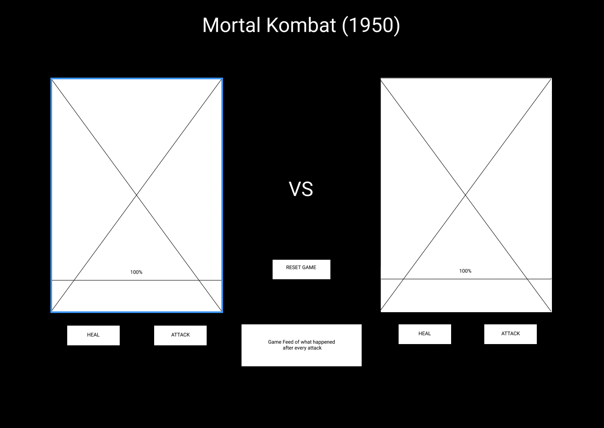
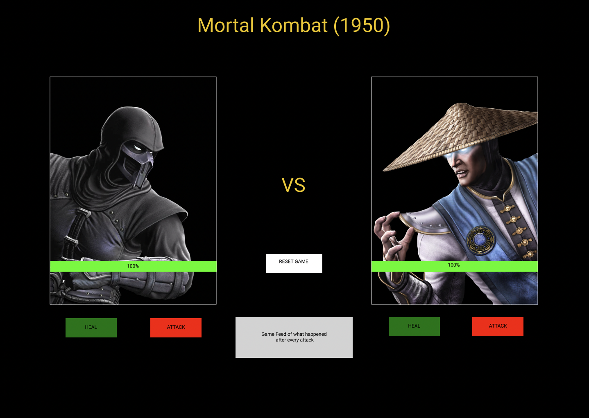

# Mortal Kombat 1950
## Game Summary:

This is Mortal Kombat (1950) a throwback to the classic fighting game we all know and love. This simple game works with two buttons, attack and heal. The premise of the game to kill your opponent and win the battle. There is some luck involved but a little bit of strategy as well. Players who time their attacks and heals in the right moments come out as victorious. Click the link to play the game. <a href = http://127.0.0.1:5500/Project-1-MortalKombatGame/index.html> PLAY GAME </a>
## Pseudocode:

1. Define required Constants:
    1. Define player 1, define health & attack bar, 
    1. Computer, define health & attack bar, 
    1.  Define Game Feed
2. Grab elements from HTML using DOM:
    1.  Grab all buttons: reset button, attack button, heal button,
    1.  Grab health div, attack div, reset div, modify text.content for player 1 and computer to auto update health bar
3. Add Event Listeners:
    1. Attack button, health button and Reset button. 
4. Functions we need:
    1.  User and computer Attack function, 
        1.  User attack variable and set it to the computer health and subtract from it 
        1.  Random number for attack
    1.  User heal function, 
        1.  User heal variable and add random number from user heal variable to the users health
        1.  Random number for heal
    1.  user and computer update health function,
    1.  Reset function attaches reset button 
    1.  Function to check who wins
5. Attack button functionality
    1.  If Attack button is clicked then reduce computer health via random number
        1.  Check if enemy is dead 
    1.  Computer attack should reduce player health via random number
        1.  Check if player is dead
6. Heal Button functionality 
    1.  If heal button is clicked then increase player health via random number
        1.  Check if player is dead
    1.  Computer Heal should increase computer health via random number
        1.  Check if player is dead
7. Optional features
    1. Add functionality for player 2
    1. Select multiple fighters before the game starts
    1. Have a cool KO slogan after the fight ends
    1. Add block attack functionality to the game
    1. Add Mortal Kombat KO Audio

## Wire Frame:

## Prototype:

